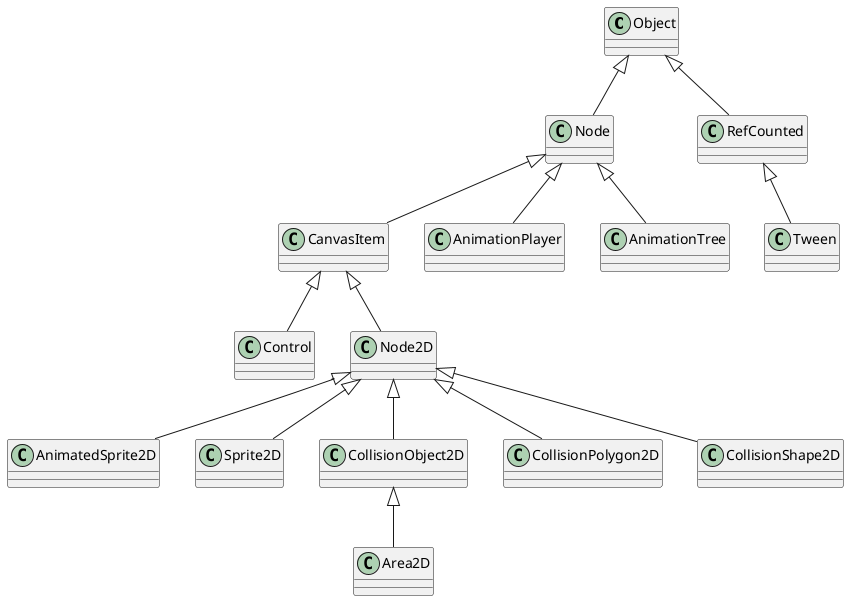

# godot

1. [Common](#common)
   1. [Texture](#texture)
2. [2D](#2d)
   1. [Classes](#classes)
      1. [Comman class description](#comman-class-description)
      2. [Sprite2D](#sprite2d)
      3. [AnimatedSprite2D](#animatedsprite2d)
      4. [AnimationPlayer](#animationplayer)
      5. [Tween](#tween)
         1. [Tween v.s. AnimationPlayer](#tween-vs-animationplayer)
      6. [AnimationTree](#animationtree)
      7. [CollisionObject2D](#collisionobject2d)
      8. [Area2D](#area2d)
      9. [CollisionPolygon2D](#collisionpolygon2d)
      10. [CollisionShape2D](#collisionshape2d)
   2. [ConvasLayer](#convaslayer)
3. [Control](#control)
4. [Transform](#transform)
5. [Physics \& Collision](#physics--collision)
   1. [Terminology](#terminology)
   2. [4 collision object types](#4-collision-object-types)
      1. [1-`Area2D`](#1-area2d)
      2. [2-`StaticBody2D`](#2-staticbody2d)
      3. [3-`RigidBody2D`](#3-rigidbody2d)
      4. [4-`CharacterBody2D`](#4-characterbody2d)
         1. [`move_and_slide` \& `move_and_collide`](#move_and_slide--move_and_collide)
         2. [Character collision response](#character-collision-response)
   3. [Collision layers and masks](#collision-layers-and-masks)
6. [Process](#process)
   1. [Console Porting](#console-porting)
7. [Ideas](#ideas)
8. [References](#references)
   1. [Diff Resolution](#diff-resolution)
      1. [Hardware Survey by Steam](#hardware-survey-by-steam)


## Common

- The coordinate origin `(0, 0)` in Godot is **top-left corner** of the screen.

### Texture

```text
In the Godot engine, a texture is a resource that represents an image or graphical data. It can be used in various ways, such as:

1. Sprite Textures: Textures can be assigned to the texture property of a Sprite node to define what image or graphic should be displayed.

2. Materials: Textures can be used as part of a material to define the visual appearance of 3D objects. They can control properties such as color, reflectivity, roughness, and more.

3. GUI Elements: Textures can be used for creating custom GUI elements, such as buttons, icons, or backgrounds, by assigning them to appropriate control nodes.

4. Shaders: Textures can be accessed and manipulated within custom shaders to create advanced visual effects.

Textures can be sourced from various file formats, such as PNG, JPEG, or BMP, and can be imported into the Godot engine's resource system.

```

## 2D 

### Classes



#### Comman class description

```
Node2D:
Node2D是Godot中2D节点的基类。它提供了基本的定位、缩放、旋转和处理输入事件的功能。它是许多其他2D节点的父类。

Sprite:
Sprite是一个用于显示2D图像或纹理的节点。它可以用于角色、物体、背景等。可以使用精灵表或单个帧来实现精灵动画。

AnimatedSprite:
AnimatedSprite是Sprite的子类，可以轻松地使用帧来对精灵进行动画处理。通过指定帧和它们的持续时间来定义动画，可以创建平滑的角色或其他物体动画。

KinematicBody2D:
KinematicBody2D是基于物理的节点，表示具有受控移动的对象。它可以使用自定义代码移动、滑动和与其他对象碰撞。通常用于玩家角色和交互对象。

RigidBody2D:
RigidBody2D是基于物理的节点，模拟真实的物理交互。它可以自动处理碰撞、力和冲力，适用于需要更复杂物理模拟的对象。

TileMap:
TileMap是用于创建2D基于瓦片的世界的节点。它允许您定义和排列瓦片以创建关卡、地形和地图。常用于平台游戏、角色扮演游戏和其他使用瓦片图形的游戏。

CollisionShape2D:
CollisionShape2D是用于定义2D物理碰撞形状的节点。它可与KinematicBody2D或RigidBody2D一起使用，以检测与其他对象的碰撞。
```

#### Sprite2D

A node that displays a 2D texture. 

Properties:
  ```
  bool flip_h/flip_v, int frame, int hframes/vframes, Textture2D textture, Rect2 region_rect, ...
  ```


#### AnimatedSprite2D

Similar to `Sprite2D`, except it carries multiple textures as animation frames. Animations are created using a `SpriteFrames`.

- Properties:
  ```
  SpriteFrames sprite_frames, StringName animation, String autoplay, float speed_scale, ...
  ```
- Methods:
  ```
  play(name, speed, from_end), stop(), pause(), is_palying(), get_playing_speed(), ...
  ```
  - `play()`
    If this method is called with that same animation name, or with no name parameter, the assigned animation will resume playing if it was paused.

#### AnimationPlayer

Player of `Animation` resources.

`AnimationPlayer` is more suited than `Tween` for animations where you know the final values in advance.

#### Tween

Tweens are mostly useful for animations requiring a numerical property to be interpolated over a range of values. The name tween comes from in-betweening, an animation technique where you specify keyframes and the computer interpolates the frames that appear between them.

##### Tween v.s. AnimationPlayer

Tween is more suited than AnimationPlayer for animations where you don't know the final values in advance. For example, interpolating a dynamically-chosen camera zoom value is best done with a Tween; it would be difficult to do the same thing with an AnimationPlayer node. 

#### AnimationTree

A node to be used for advanced animation transitions in an AnimationPlayer.

#### CollisionObject2D

**Base node** for 2D collision objects.
**Note:** `Only collisions between objects within the same canvas (Viewport canvas or CanvasLayer) are supported.`

- Properties:
  ```
  int collision_layer, int collision_mask, float collision_priority, DisableMode disable_mode, bool input_pickable
  ```
  - `int collision_layer`: the physic layer this `CollisionObject2D` is in.
  - `int collision_mask`: the physics layers this `CollisionObjet2D` scans.
    **Note:** `Object A can detect a contact with object B only if object B is in any of the layers that object A scans.`
  - `float collision_priority`: The priority used to solve colliding when occurring penetration. The higher the priority is, the lower the penetration into the object will be.
- Methods:
  ```
  _input_event(), mouse_enter(), 
  ```

#### Area2D

2D area for detection (detects `CollisionObject2D` nodes overlapping, entering, or exiting), as well as physics and audio influence.

- Projecties:
  ```
  float gravity, foloat angular_damp, Vector2 gravity_direction,
  ```
- Methods:
  ```
  Area2D[] get_overlapping_areas();
  Node2D[] get_overlapping_bodies();
  bool has_overlapping_areas();
  bool overlaps_bodies(Node body);
  ```
- Signals:
  ```
  area_entered ( Area2D area ), body_exited ( Node2D body )
  ```

#### CollisionPolygon2D

Provides a concave or convex 2D collision polygon to a `CollisionObject2D` parent.

#### CollisionShape2D

- `one_way_collision`: Sets whether this collision shape should only detect collision on one side (top or bottom).
  **NOTE:** This property has no effect if this CollisionShape2D is a child of an Area2D node.


--------

### ConvasLayer

- ConvaLayers are independent of tryy order, and they only depend on their layer number.
- 2D nodes have `CanvasItem.z_index` property controlling their drawing order.

## Control

- [Widget Gallery](https://docs.godotengine.org/en/stable/tutorials/ui/control_node_gallery.html)

  - [Control Gallery @ Github](https://github.com/godotengine/godot-demo-projects/tree/master/gui/control_gallery)

## Transform

> Keep in mind, however, that it is generally not desired to work with screen coordinates. The recommended approach is to simply work in Canvas coordinates (CanvasItem.get_global_transform()), to allow automatic screen resolution resizing to work properly.
  - [2D Transforms](https://docs.godotengine.org/en/stable/tutorials/2d/2d_transforms.html)

--------

## Physics & Collision

- [Physics introduction](https://docs.godotengine.org/en/stable/tutorials/physics/physics_introduction.html#collision-layers-and-masks)

### Terminology

```
friction 摩擦
bounce 回弹
impulses 冲量
absorbent  吸附/吸收
```

### 4 collision object types

```plantuml
CollisionObject2D <|-- Area2D
CollisionObject2D <|-- StaticBody2D
CollisionObject2D <|-- RigidBody2D
CollisionObject2D <|-- CharacterBody2D
PhysicsBody2D <|-- StaticBody2D
PhysicsBody2D <|-- RigidBody2D
PhysicsBody2D <|-- CharacterBody2D
StaticBody2D *-- PhysicsMaterial
RigidBody2D *-- PhysicsMaterial
CollisionShape2D
CollisionPolygon2D
```


#### 1-`Area2D`
  provide detection (detect bodies enter/exit and emit signals) and influence (physic effect?). Can also override physics properties (gravity, damping)
  - `Area2D` is great for overlap detecting withoud physic collision/effect.
    - Coin collection
    - bullet damage

#### 2-`StaticBody2D`
  collision detection but not move in response to collision. Are most often used for environment object (not moved).
#### 3-`RigidBody2D`
  this node implements simulated 2D physics. apply a force (gravity, impulses...) to it, engine calculates the resulting movement, you don't control it directly.
#### 4-`CharacterBody2D`
  collision detection, ~~but no physics (influence)~~ (not affected by physics engine properties ???). movement and collision response must be implemented in code.

##### `move_and_slide` & `move_and_collide`
  - sample with godot 3.x, indicates `move_and_slide` and `move_and_collide` can be used in `_physics_process`
  ```javascript
  extends KinematicBody2D

  func _physics_process(delta: float) -> void:
      var velocity = Vector2.ZERO

      # Apply movement logic to the velocity vector here

      # Use move_and_slide for smooth sliding motion on floors and slopes
      velocity = move_and_slide(velocity, Vector2.UP)

      # Use move_and_collide for explicit collision handling with walls or other objects
      var collision = move_and_collide(velocity)

      # Handle collision responses based on the collision information
      if collision:
          # Custom collision response logic here
          
      # Perform other physics-related calculations or actions here

      # ========================== added by me
      ## in godot 4.x, move_and_collide should work witd delta, move_and_slide should not.
      # move_and_collide(velocity * delta)
      # move_and_slide()
  }

  ```

- One way to think of it is that move_and_slide() is a special case, and move_and_collide() is more general.
- anythins you do with `move_and_slide` can also be don2 with `move_and_collide`. Not vice verse.

###### `move_and_slide`

- defined in `CharacterBody2D`
- related properties
  - `velocity: Vector2` - pixels per second, used and modified duing calls to `move_and_slice`
  - `motion_mode`
  - `up_direction`
  - `floor_stop_on_slope`
  - `wall_min_slide_angle`
  - `floor_max_angle`
- handle collision
  - `get_slide_collision_count` and `get_slid_collision`
  ```
  # Using move_and_slide.
  move_and_slide()
  for i in get_slide_collision_count():
      var collision = get_slide_collision(i)
      print("I collided with ", collision.get_collider().name)
  ```


###### `move_and_collide`

- defined in `PhysicsBody2D`
- `KinematicCollision2D move_and_collide ( Vector2 motion, bool test_only=false, float safe_margin=0.08, bool recovery_as_collision=false )`
  - the parameter `motion` generally is the velocity vector multipled by `delta` of `_physics_process(delta)`

- handle collision by the returned `KinematicCollision2D`
  ```
  # Using move_and_collide.
  var collision = move_and_collide(velocity * delta)
  if collision:
      print("I collided with ", collision.get_collider().name)
  ```
- usage sample: bullet collides with body/wall

##### Character collision response

- `move_and_colide`
- `move_and_slide`
  **WARN:** move_and_slide() automatically includes the timestep in its calculation, so **you should not multiply the velocity vector by delta.**

###### **IMPORTTANT NOTE:** 
  _never scale a collision shape, keep its `scale` proper always be `(1,1)`._

- physics engine runs in a fix rate (60 iterations per second by default)
  - it's diff from *frame rate*. 
- idle processing: code runs each frame
- physics processing: code runs on each physics tick


- `Node._physics_process(delta)` is called before each physics step
  - `delta` parameter means *time passsed since last step*, by defualt it should be `1/60`, but not always
  - always use `delta` in your physics calculation

### Collision layers and masks

Ref to [CollisionObject2D section](#collisionobject2d).

- `collision_layer`: layers that the object appears in. by default layer 1.
- `collision_mask`: layers the body will scan for collision. by default 1.

Assign names to layers: `Project Settings -> Layer Names`

--------

## Process

### Console Porting

- [Console Support](https://docs.godotengine.org/en/stable/tutorials/platform/consoles.html#doc-consoles)

- Console publishing process
  Regardless of the engine used to create the game, the process to publish a game to a console platform is as follows:
  ```
  Register a developer account on the console manufacturer's website, then sign NDAs and publishing contracts. This requires you to have a registered legal entity.

  Gain access to the publishing platform by passing the acceptance process. This can take up to several months. Note that this step is significantly easier if an established publisher is backing your game. Nintendo(任天堂) is generally known to be more accepting of smaller developers, but this is not guaranteed.

  Get access to developer tools and order a console specially made for developers (devkit). The cost of those devkits is confidential.

  Port the engine to the console platform or pay a company to do it.

  To be published, your game needs to be rated in the regions you'd like to sell it in. For example, game ratings are handled by ESRB in North America, and PEGI in Europe. Indie developers can generally get a rating for cheaper compared to more established developers.

  Due to the complexity of the process, many studios and developers prefer to outsource console porting.
  ```

--------

## Ideas

- Angry birds: RigidBody2D


--------

## References

### Diff Resolution

- https://docs.godotengine.org/en/stable/tutorials/rendering/multiple_resolutions.html#doc-multiple-resolutions-stretch-scale
  - specific suggestions for diff device/size
 
- https://docs.godotengine.org/en/stable/tutorials/rendering/multiple_resolutions.html#doc-multiple-resolutions
  **For 2D, develop a base resulotion and fit to everything else.**
  3D is much easier.

#### [Hardware Survey by Steam](https://store.steampowered.com/hwsurvey/)

- 202306
  - OS: win64
  - Resolution: 1920x1080
  - Language: eng


