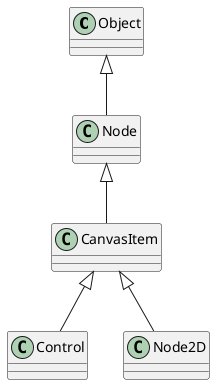

# godot

1. [Common](#common)
2. [2D](#2d)
   1. [Classes](#classes)
      1. [Structure](#structure)
   2. [ConvasLayer](#convaslayer)
3. [Control](#control)
4. [Transform](#transform)
5. [Process](#process)
   1. [Console Porting](#console-porting)
6. [References](#references)
   1. [Diff Resolution](#diff-resolution)
      1. [Hardware Survey by Steam](#hardware-survey-by-steam)


## Common

- The coordinate origin `(0, 0)` in Godot is top-left corner of the screen.

## 2D 

### Classes

```
Node2D:
Node2D是Godot中2D节点的基类。它提供了基本的定位、缩放、旋转和处理输入事件的功能。它是许多其他2D节点的父类。

Sprite:
Sprite是一个用于显示2D图像或纹理的节点。它可以用于角色、物体、背景等。可以使用精灵表或单个帧来实现精灵动画。

AnimatedSprite:
AnimatedSprite是Sprite的子类，可以轻松地使用帧来对精灵进行动画处理。通过指定帧和它们的持续时间来定义动画，可以创建平滑的角色或其他物体动画。

KinematicBody2D:
KinematicBody2D是基于物理的节点，表示具有受控移动的对象。它可以使用自定义代码移动、滑动和与其他对象碰撞。通常用于玩家角色和交互对象。

RigidBody2D:
RigidBody2D是基于物理的节点，模拟真实的物理交互。它可以自动处理碰撞、力和冲力，适用于需要更复杂物理模拟的对象。

TileMap:
TileMap是用于创建2D基于瓦片的世界的节点。它允许您定义和排列瓦片以创建关卡、地形和地图。常用于平台游戏、角色扮演游戏和其他使用瓦片图形的游戏。

CollisionShape2D:
CollisionShape2D是用于定义2D物理碰撞形状的节点。它可与KinematicBody2D或RigidBody2D一起使用，以检测与其他对象的碰撞。
```

#### Structure



### ConvasLayer

- ConvaLayers are independent of tryy order, and they only depend on their layer number.
- 2D nodes have `CanvasItem.z_index` property controlling their drawing order.

## Control

- [Widget Gallery](https://docs.godotengine.org/en/stable/tutorials/ui/control_node_gallery.html)

  - [Control Gallery @ Github](https://github.com/godotengine/godot-demo-projects/tree/master/gui/control_gallery)

## Transform

> Keep in mind, however, that it is generally not desired to work with screen coordinates. The recommended approach is to simply work in Canvas coordinates (CanvasItem.get_global_transform()), to allow automatic screen resolution resizing to work properly.
  - [2D Transforms](https://docs.godotengine.org/en/stable/tutorials/2d/2d_transforms.html)

## Process

### Console Porting

- [Console Support](https://docs.godotengine.org/en/stable/tutorials/platform/consoles.html#doc-consoles)

- Console publishing process
  Regardless of the engine used to create the game, the process to publish a game to a console platform is as follows:
  ```
  Register a developer account on the console manufacturer's website, then sign NDAs and publishing contracts. This requires you to have a registered legal entity.

  Gain access to the publishing platform by passing the acceptance process. This can take up to several months. Note that this step is significantly easier if an established publisher is backing your game. Nintendo(任天堂) is generally known to be more accepting of smaller developers, but this is not guaranteed.

  Get access to developer tools and order a console specially made for developers (devkit). The cost of those devkits is confidential.

  Port the engine to the console platform or pay a company to do it.

  To be published, your game needs to be rated in the regions you'd like to sell it in. For example, game ratings are handled by ESRB in North America, and PEGI in Europe. Indie developers can generally get a rating for cheaper compared to more established developers.

  Due to the complexity of the process, many studios and developers prefer to outsource console porting.
  ```


## References

### Diff Resolution

- https://docs.godotengine.org/en/stable/tutorials/rendering/multiple_resolutions.html#doc-multiple-resolutions-stretch-scale
  - specific suggestions for diff device/size
 
- https://docs.godotengine.org/en/stable/tutorials/rendering/multiple_resolutions.html#doc-multiple-resolutions
  **For 2D, develop a base resulotion and fit to everything else.**
  3D is much easier.

#### [Hardware Survey by Steam](https://store.steampowered.com/hwsurvey/)

- 202306
  - OS: win64
  - Resolution: 1920x1080
  - Language: eng


